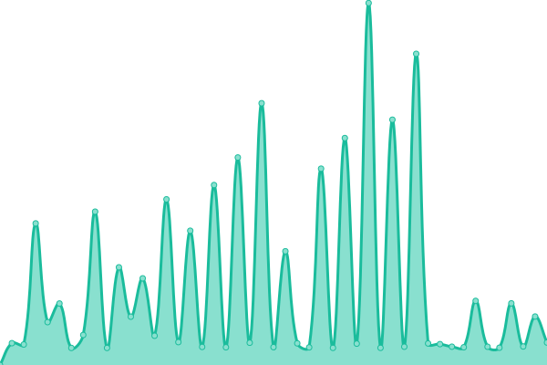
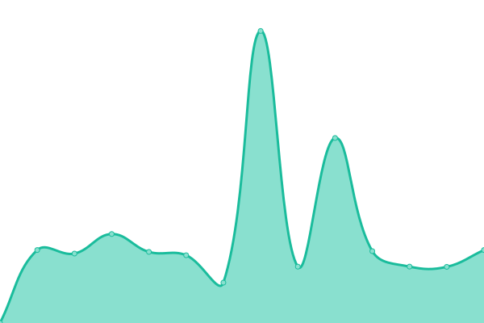

# [📈 Live Status](https://demo.upptime.js.org): <!--live status--> **🟩 All systems operational**

This repository contains the open-source uptime monitor and status page for [Upptime](https://upptime.js.org), powered by [Upptime](https://github.com/upptime/upptime).

With [Upptime](https://upptime.js.org), you can get your own unlimited and free uptime monitor and status page, powered entirely by a GitHub repository. We use [Issues](https://github.com/upptime/upptime/issues) as incident reports, [Actions](https://github.com/littleBanshee/upptime/actions) as uptime monitors, and [Pages](https://demo.upptime.js.org) for the status page.

<!--start: status pages-->
<!-- This summary is generated by Upptime (https://github.com/upptime/upptime) -->
<!-- Do not edit this manually, your changes will be overwritten -->
<!-- prettier-ignore -->
| URL | Status | History | Response Time | Uptime |
| --- | ------ | ------- | ------------- | ------ |
|  Univ Home | 🟩 Up | [univ-home.yml](https://github.com/littleBanshee/upptime/commits/HEAD/history/univ-home.yml) | 

 5837ms
     
 | 

<a href="https://littleBanshee.github.io/upptime/history/univ-home">83.15%</a>
    

|  Univ SSO | 🟩 Up | [univ-sso.yml](https://github.com/littleBanshee/upptime/commits/HEAD/history/univ-sso.yml) | 

 2018ms
     
 | 

<a href="https://littleBanshee.github.io/upptime/history/univ-sso">100.00%</a>
    

|  Univ Shibboleth | 🟩 Up | [univ-shibboleth.yml](https://github.com/littleBanshee/upptime/commits/HEAD/history/univ-shibboleth.yml) | 

 2032ms
     
 | 

<a href="https://littleBanshee.github.io/upptime/history/univ-shibboleth">100.00%</a>
    

|  Univ IMAPS | 🟩 Up | [univ-imaps.yml](https://github.com/littleBanshee/upptime/commits/HEAD/history/univ-imaps.yml) | 

 239ms
     
 | 

<a href="https://littleBanshee.github.io/upptime/history/univ-imaps">100.00%</a>
    

|  Univ SMTPS | 🟩 Up | [univ-smtps.yml](https://github.com/littleBanshee/upptime/commits/HEAD/history/univ-smtps.yml) | 

 240ms
     
 | 

<a href="https://littleBanshee.github.io/upptime/history/univ-smtps">100.00%</a>
    

|  Univ VPN1 | 🟩 Up | [univ-vpn-1.yml](https://github.com/littleBanshee/upptime/commits/HEAD/history/univ-vpn-1.yml) | 

 567ms
     
 | 

<a href="https://littleBanshee.github.io/upptime/history/univ-vpn-1">95.26%</a>
    

|  Univ VPN2 | 🟩 Up | [univ-vpn-2.yml](https://github.com/littleBanshee/upptime/commits/HEAD/history/univ-vpn-2.yml) | 

 1818ms
     
 | 

<a href="https://littleBanshee.github.io/upptime/history/univ-vpn-2">100.00%</a>
    

|  Univ VPNx | 🟩 Up | [univ-vp-nx.yml](https://github.com/littleBanshee/upptime/commits/HEAD/history/univ-vp-nx.yml) | 

 649ms
     
 | 

<a href="https://littleBanshee.github.io/upptime/history/univ-vp-nx">100.00%</a>
    

<!--end: status pages-->

[**Visit our status website →**](https://demo.upptime.js.org)

## 📄 License

- Powered by: [Upptime](https://github.com/upptime/upptime)
- Code: [MIT](./LICENSE) © [Upptime](https://upptime.js.org)
- Data in the `./history` directory: [Open Database License](https://opendatacommons.org/licenses/odbl/1-0/)
